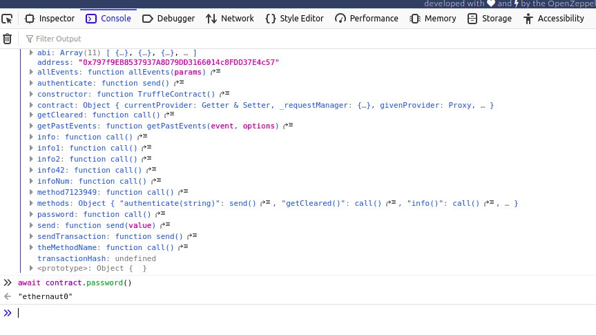
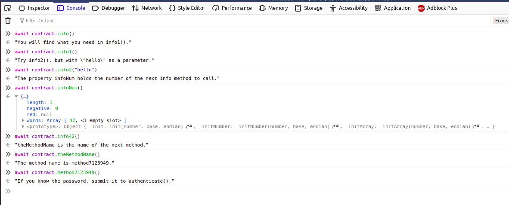

I’ve recently started going through the [Ethernaut CTF/wargame challenges](https://ethernaut.openzeppelin.com/). Here we’ll walk through the first few levels. 

I read that the Ethernaut game was inspired by [overthewire](https://overthewire.org/wargames/), which I did together with my best friend several years ago when I was learning linux. In fact, this friend is the one who first showed me how to install ubuntu! With all these warm and fuzzy memories, I had high hopes for Ethernaut, and so far I’ve been very much enjoying it.

In each level of Ethernaut you need to find and exploit some security vulnerabilities in a smart contract. You’re playing from inside the EVM, with contracts written in Solidity.

**Level 0 - Hello Ethernaut**

This little introduction level teaches you how to play. 

You’ll need to install the metamask plugin if you don’t already have it in your browser, and then connect it to the Rinkeby test network and get some eth from a faucet.

As of this time of writing, the only functional faucet I could find required either a facebook or twitter account. Lately I’ve been thinking about identity as a concept and the role it plays in our lives, so this was interesting fuel for my ruminations.

Anyway, with my eth in hand thanks to a sockpuppet account, I was able to generate a new instance of this level and call the various contract functions from the web console.

The first thing I did was look at the contract’s ABI as suggested, and I noticed a function named `password`. So naturally I did what any reasonable person would do… I called the `password()` method.

Now armed with what appeared to be the password, I had to figure out what to do with it. 

The instructions said to call the contract’s info method, so I did that and just kept going down the rabbit hole until I found I needed to pass the password to the `authenticate()` method as an argument.

My submission was a success and I could then move on to the next level.