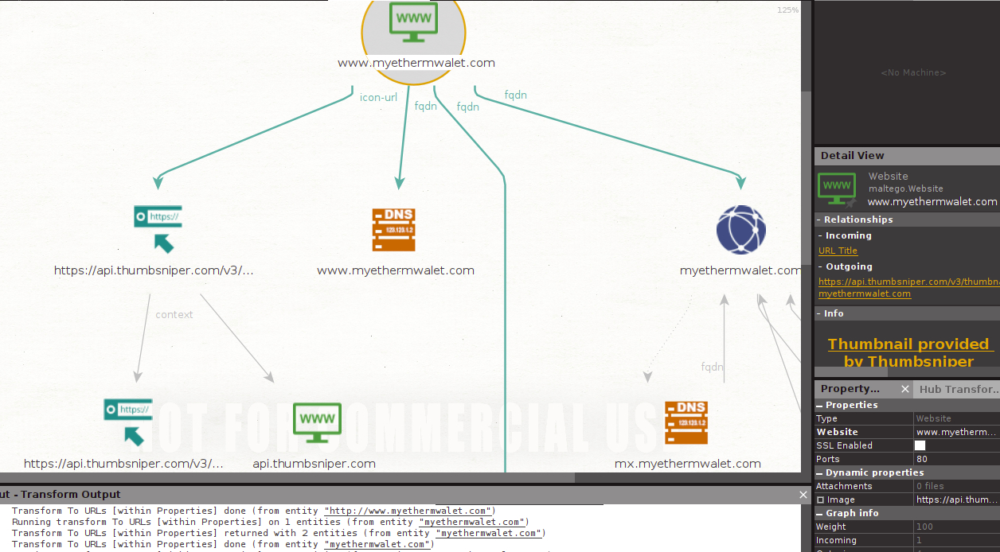

The other day I was reading a really interesting article about a type of phishing kit that interacts with a website’s DOM through embedded javascript functions in order to [“dynamically alter the visible content and HTML form data within a page without user interaction”](https://community.riskiq.com/article/a068810a). 

I wondered if I could find some evidence of this sort of phishing kit through OSINT investigations of phishing sites. 

One of the capabilities of some of these phishing kits is to fetch company logos from a third-party service and then display it after a phishing victim has navigated to the phishing URL. Therefore, I decided to look for evidence of this by searching for third-party URLs contained within the phishing site's entity properties using Maltego transforms.

I found a list of known crypto phishing domains on [the github page of the IronCoin project](https://github.com/ironcoinext/IronCoin). I then input a few of the domains into Maltego and ran the `props.entityToURL` transform on them.

After about 15 minutes of this and nothing in particular pointing to the use of this kind of modular phishing kit, I struck gold. 

This is where I ended my investigation, so of course I can’t be sure of exactly what is going on behind the scenes. However, the fact that there appears to be an API call made to a service that fetches website thumbnails suggests to me that this particular page may indeed make use of this type of phishing kit.